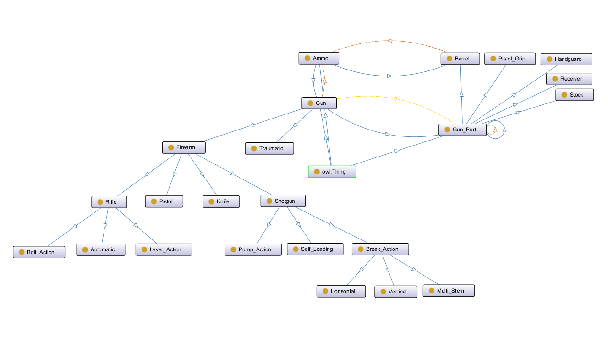

# Онтология гражданского стрелкового оружия

3 основные сущности:
- патрон, характеризуется калибром, патроном, моделью
- оружие, характеризуется моделью, длиной, весом
- оружейная деталь, характеризуется моделью, длиной, весом

Оружейные детали делятся на:
- стволы, которые могут использовать только некоторые патроны
- цевья
- ресиверы
- приклады
- пистолетные рукояти

Оружие состоит из оружейных деталей, может использовать только некоторые патроны
и делится на:
- травматическое
- огнестрельное

Огнестрельное оружие делится на:
- винтовки
- пистолеты
- дробовики
- ножи (нп. НРС-2)

Винтовки и дробовики делятся на более узкие подтипы.
